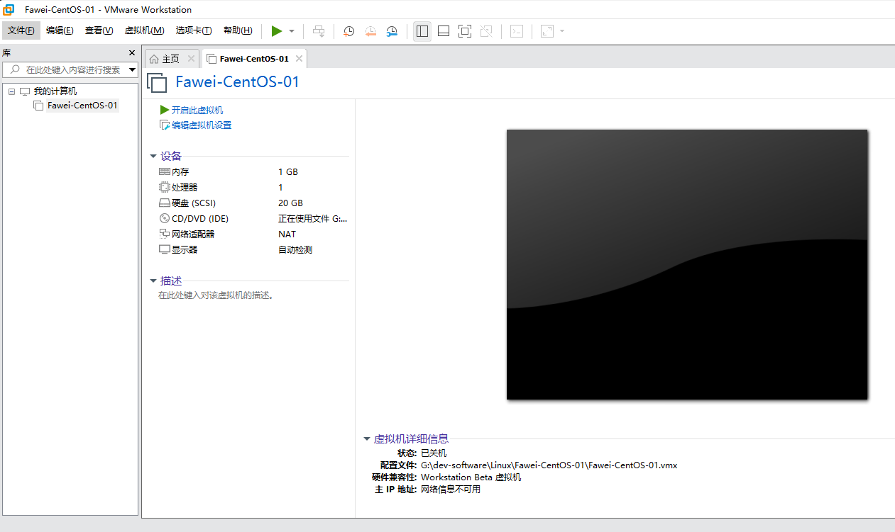
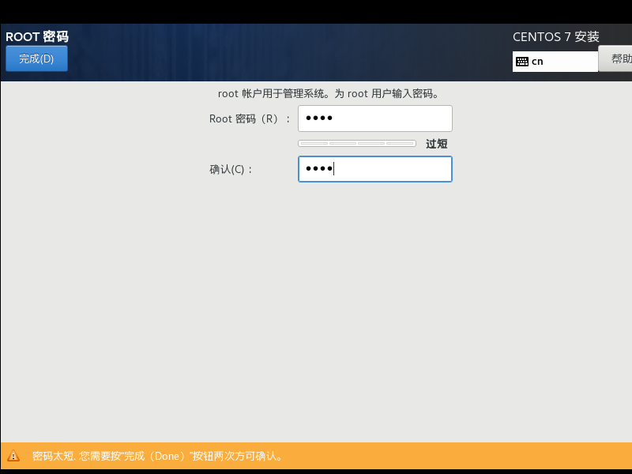

# Create CentOS server

## 前期准备

- 下载并安转VMWare,自己想办法搞定License
- 下载CentOS 镜像
[163镜像:https://mirrors.163.com/centos/7.9.2009/isos/x86_64/](https://mirrors.163.com/centos/7.9.2009/isos/x86_64/)

## Step 1 新建虚拟机

- 选择 典型

- 选择 稍后安装操作系统

- 选择CentOS 7 64位

- 起名，选择安装目录

- 设置虚拟磁盘大小

- 虚拟机基本设置完毕

- 配置硬件

## Step 2 选择CentOS镜像

- 选择CD/DVD,选择之前下载好的CentOS镜像文件

- 关闭硬件设置窗口，在新建虚拟机向导页面选择完成

> 至此虚拟机准备好了

## Step 3 安装虚拟机

- 开启虚拟机

- 选择install CentOS 7

- 安装过程中使用哪种语言

## Step 4 系统详细设置

### 本地化配置

- 选择支持语言 - 中英双语都要选

- 时区选上海

### 软件配置

- 安装源 - 默认
- 软件选择 - 按需选择

### 系统配置

#### 安装位置（分区）

- 选择 手动分区

- 添加引导分区

- 添加内存缓冲分区

- 添加数据分区 - 剩余空间全部分配到数据分区

- 完成分区 - 格式化

#### KDUMP （备份）

- 禁用备份，因为它占了160M

#### 网络和主机名

- 启动自动获取网络（DHCP）

#### Security Policy(安全策略)

- 默认

## Step 4 开始安装

## Step 5 设置ROOT密码

## Step 6 重启

- 安装完成后根据提示进行重启，至此CentOS 系统安装完毕
